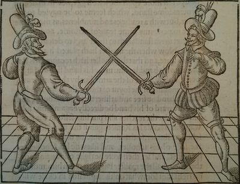

# IMT511-Assignment

# George Silver challenges Vincentio Saviolo to duel!

While George Silver's martial lineage is **unknown**, he was possessed of strong opinions about the 
proper method of fencing and was **strongly** opposed to the contemporary Continental fencing 
traditions. He was _particularly_ critical of the Italian masters who had set up schools in 
London, including _Rocco Bonetti_ and _Vincentio Saviolo_. He and Toby went so far as to challenge 
Saviolo to a public fencing match to demonstrate the superiority of his **British arts**, 
but even though they placarded London, Southwark, and Westminster with the challenge, and had 
it carried to Saviolo personally on the appointed day, Silver states that _no_ formal match 
occurred.

"Silver challenged Saviolo to fence him at ten weapons, beginning with the single rapier 
and rapier and dagger, which suggests that Silver had at least a passing familiarity with 
those weapons."